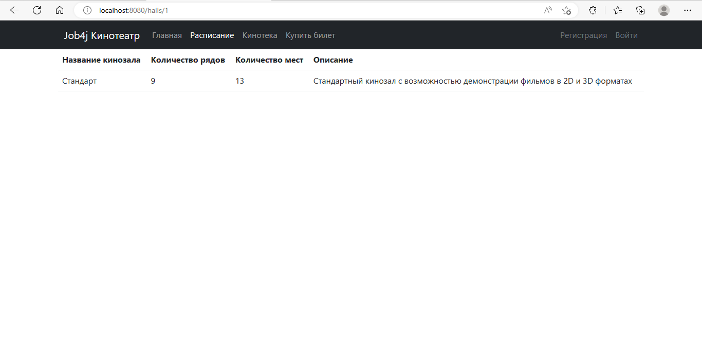

# Кинотеатр job4j_cinema

## О проекте

Приложение "Кинотеатр".
В этом учебном приложении разработан сервис по покупке билетов в кинотеатр.
Сервис предназначен для одного кинотеатра.

 Сервис состоит из:
- главной страницы, которая выводит общую информацию о ресурсе;
- кинотеки, которая содержит список всех фильмов, находящихся в кинопрокате. Для получения подробной информации об
  интересующем фильме, можно перейти на страницу с содержанием фильма;
- расписания, которое позволяет выбрать сеанс и связанный с ним фильм.
- страницы покупки билета, где, указав предпочтительный ряд и место, приобрести билет, либо отказать от покупки;
- страницы регистрации и авторизации пользователя.

## Стек технологий
- **Java 17**
- **Spring Boot 2.7.6**
- **Maven 3.8**
- **Git**
- **PostgreSQL 14**
- **Thymeleaf** 
- **Bootstrap 5.2.3**
- **Liquibase 4.15.0**
- **sql2o 1.6.0**
- **H2 1.4.2**
- **Mockito 4.8.0**

## Требования к окружению
- **Java 17**
- **Maven 3.8**
- **PostgreSQL 14**

## Сборка и запуск<br>
- **Cоздать базу данных**
 
 ``` shell 
create database cinema;
```
- **Запустить проект по команде**
- 
``` shell 
mvn spring-boot:run
```

## Взаимодействие с приложением.

На главной странице выведена общая информация о ресурсе.


На странице с кинотекой выведен список фильмов.


Чтобы получить информацию о фильме, необходимо перейти на его страницу.


На странице с расписанием выведены сеансы и связанные с ними фильмы.


На странице с киносеансами выведена информация о зале в котором будет показ этого фильма.


Форма для авторизации.


Купить билет может только зарегистрированный пользователь. Форма регистрации.


Зарегистрированный пользователь может приобрести билет, указав необходимые ряд и место.


Если выбранное место не занято, то выйдет сообщение об удачной покупке.


Если выбранное место занято, то выйдет сообщение о неудачной покупке.


## Контакты для связи<br>
> Связаться со мной [TELEGRAM](https://t.me/AlekseyNovoselov/).